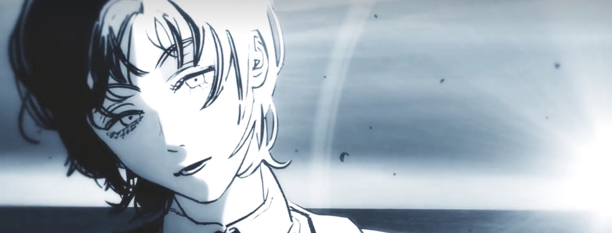

    
     
    

    

    
 

*“Between grief and nothing I will take grief.” ― William Faulkner*

Personal Interests
===

**I am a cinephile**, enjoying watching a variety of films. When I’m not immersed in mathematics, I spend the majority of my free time watching movies. My all-time favorite director is *Karwei Wong*, who first inspired my love for movies. In fact, I have a dream to be a director. You can see my Douban [here](https://movie.douban.com/people/210616758/).

The following are my TOP 15:

- *Burning (2018), directed by Lee Chang-dong*

- *Swallowtail Butterfly (1996), directed by Shunji Iwai*

- *The Curious Case of Benjamin Button (2008), directed by David Fincher*

- *Fight Club (1999), directed by David Fincher*

- *Taxi Driver (1976), directed by Martin Scorsese*

- *Days of Being Wild (1990), directed by Karwei Wong*

- *American Psycho (2000), directed by Mary Harron*

- *Thirst (2009), directed by Park Chan-wook*

- *Fallen Angels (1995), directed by Karwei Wong*

- *Interstellar (2014), directed by Christopher Nolan*

- *Ghost in the Shell 1 & 2 (1995 & 2004), directed by Mamoru Oshii*

- *Being John Malkovich (1999), directed by Spike Jonze*

- *Black Swan (2010), directed by Darren Aronofsky*

- *New World (2013), directed by Park Hoon-jung*

- *Drive My Car (2021), directed by Ryusuke Hamaguchi*

- *Three Colours: Red (1994), directed by Krzysztof Kieślowski*

My top two favorite series are: (which I consider to be PERFECT)

- Breaking Bad

- Better Call Saul

**When it comes to Anime, I have a great appreciation for the works of *Shinichirō Watanabe (渡边信一郎)* , a dual director of *Karwei Wong* in Japaness Anime.** The follows are my favourite:

- Cowboy Bebop

- Attack on Titan

> The character in Attack on Titan whom I admire most is Erwin Smith. I believe that we are of the same kind of people, both agree a saying, “朝闻道，夕死可矣。”

- Rick and Morty

- Futurama

- Neon Genesis Evangelion

**I appreciate the works from *Tatsuki Fujimoto (藤本树)* very much although I don’t read manga usually.** The following is the rank of some of his works depending on my preference: *1. Goodbye, Eri 2. Fire punch 3.Chainsaw man 4. Look Back*.

My MBTI
===

It seems that I’m an INTJ-A/INTJ-T.

> **Mind**: 82% Introverted **Energy**: 77% Intuitiive **Nature**: 68% Thinking **Tactics**: 64% Judging **Identity**: 60% Assertive

> People like to treat their daily lives as a theatrical stage, playing the roles that society expects of them in certain situations, as posited by Erving Goffmana, one sociologist.

 
 
 
 
 
 
 
 
 
