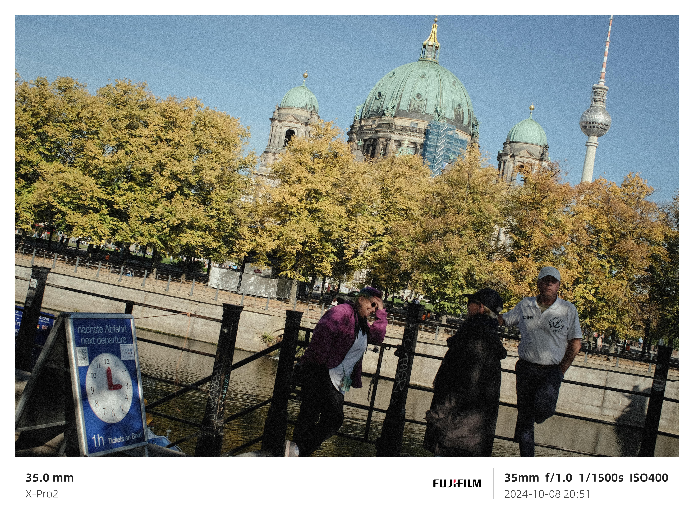
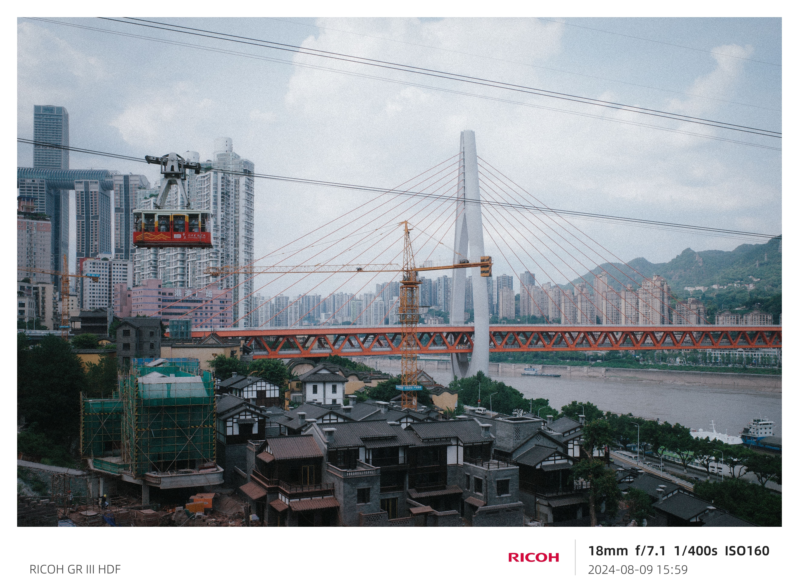
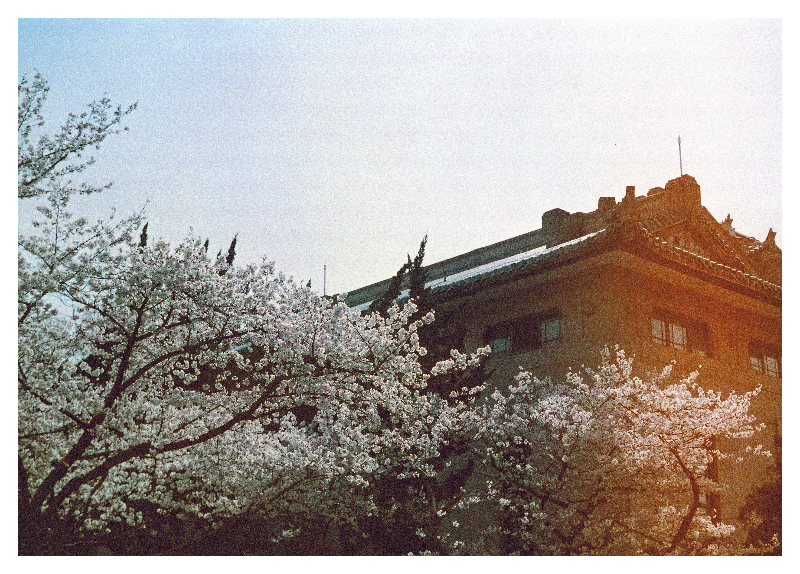
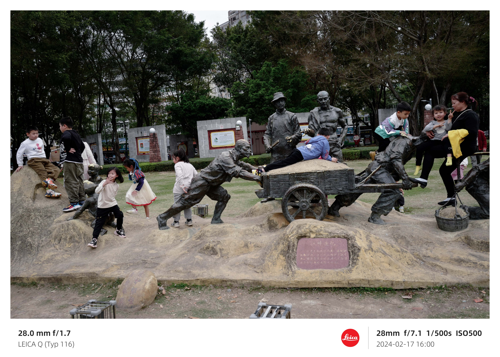

*“I really believe there are things nobody would see if I didn’t photograph them.” ― Diane Arbus*

Photographs
===

I am a semiprofessional street photographer, liking to take photos of something that most people can’t notice. I appreciate the works from *Vivian Maier*, *Ho Fan (何藩)*, *William Klein* and *Daidō Moriyama (森山大道)* very much.

> We can only see the half of our world. — A One and a Two

I will share my works on my [INS](https://www.instagram.com/yrzreiny) and [Xiaohongshu](https://www.xiaohongshu.com/user/profile/65f6bfcf000000000b00dc13), also summarize some meaningful works annually and make them into a video, published on bilibili:

[[Collections of Sakura]](https://www.bilibili.com/video/BV1UF4m1F7xP/?spm_id_from=333.999.0.0&vd_source=483ff7b5b5abbc08d378ae0ea4591ad5) [[2023]](https://www.bilibili.com/video/BV1xC4y1X7a5/?spm_id_from=333.999.0.0&vd_source=483ff7b5b5abbc08d378ae0ea4591ad5)

Some Selected Works
===

> “Which of my photographs is my favorite? The one I am going to take tomorrow.” ― Imogen Cunnigham

                           
                     
   
                           
                     
   
                           
                     
   
                           
                     
   
                           
                     
   
                         
                     
   
                         
                     
   
                         
                     
   
                         
                     
   
                         
                     
   
                         
                     
   
                         
                     
   
                         
                     
   
                         
                     
   
                         
                     
   
                         
                     
   
                         
                     
   
                         
                     
   
                         
                        
     
                     
                         
     
                     
                     
   
               
               
     
                     
                     
       
               
                     
       
               
                     
       
               
                     
       
              
                     
       
               
                     
       
              
                     
     
                     
               
     
                     
               
     
                     
               
     
                     
               
   
               
                   
   
               
                  
     
               
                
     
       
   
  
                 
                  
  
         
   
  
     
              
   
        
                 
   
        

                 
  
         
   
  
     
     
  
                 
   
  
         
   
  
     
     
   
     
           
  
         
   
  
     
     
   
     
   
  
   
   
  
  
 
  
             
   
  
             
            
  
 
      
   
 
      
   
      
      
   
      
      
   
      
      
   
      
      
   
    

        2024
    

    
 

 
    
     
      
      
      
  
      
      
  
      
      
  
      
      
  
      
      
   
      
   
  
      
   
   
   
       
  
   
     
    
    
     
    
    
     
    
    
     
    
    
     
    
    
     
    
    
     
    

        2023
    

    
 

 
 
 
 
 
 
 
 
